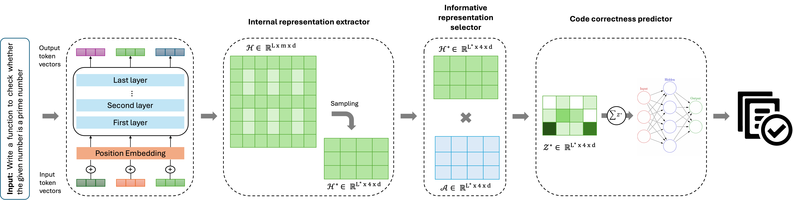

<div align="center">

# Model-Agnostic Correctness Assessment for LLM-Generated Code via Dynamic Internal Representation Selection
[](https://opensource.org/licenses/MIT) [](https://www.python.org/downloads/release/python-380/) []()
</div>

## Introduction


#### Paper: 

## The architecture



# Project Overview

# Quickstart

## Prepare Environment
First, we should set up a python environment. This code base has been tested under python 3.8.

```bash
$ conda create -n autoprobe python=3.8
$ conda activate autoprobe
$ pip install -r requirements.txt
```

# Citation
If you're using AutoProbe in your research or applications, please consider citing our paper:
```bibtex

```

# Contact us
If you have any questions, comments or suggestions, please do not hesitate to contact us.
- Email: thanhvu@vnu.edu.vn

# License
[MIT License](LICENSE)