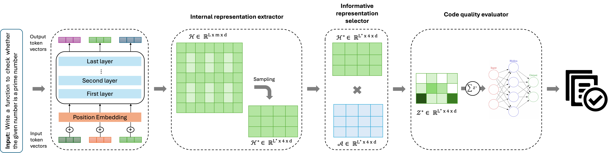
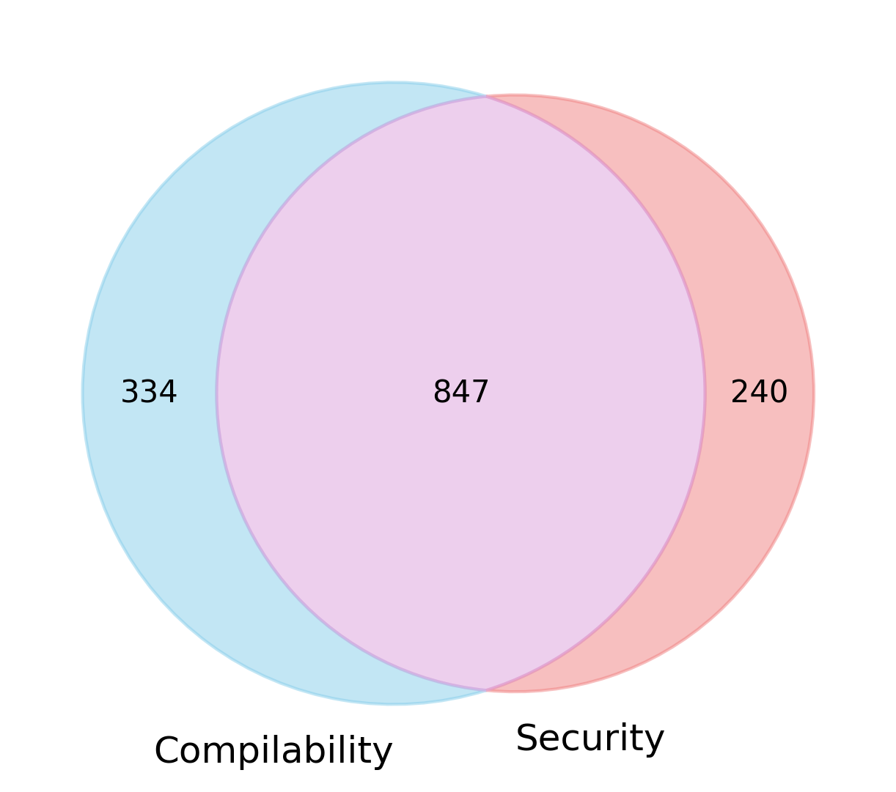
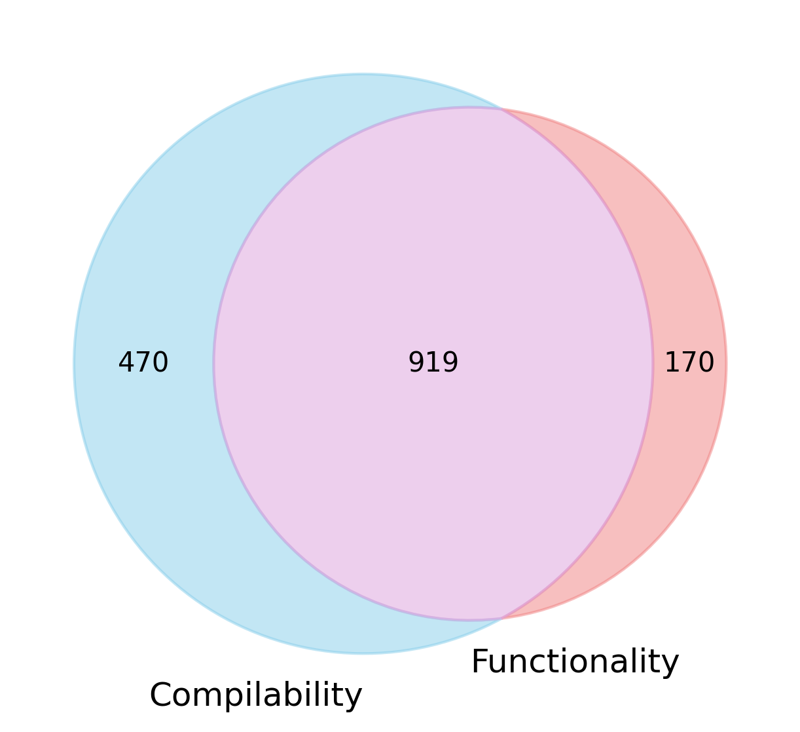
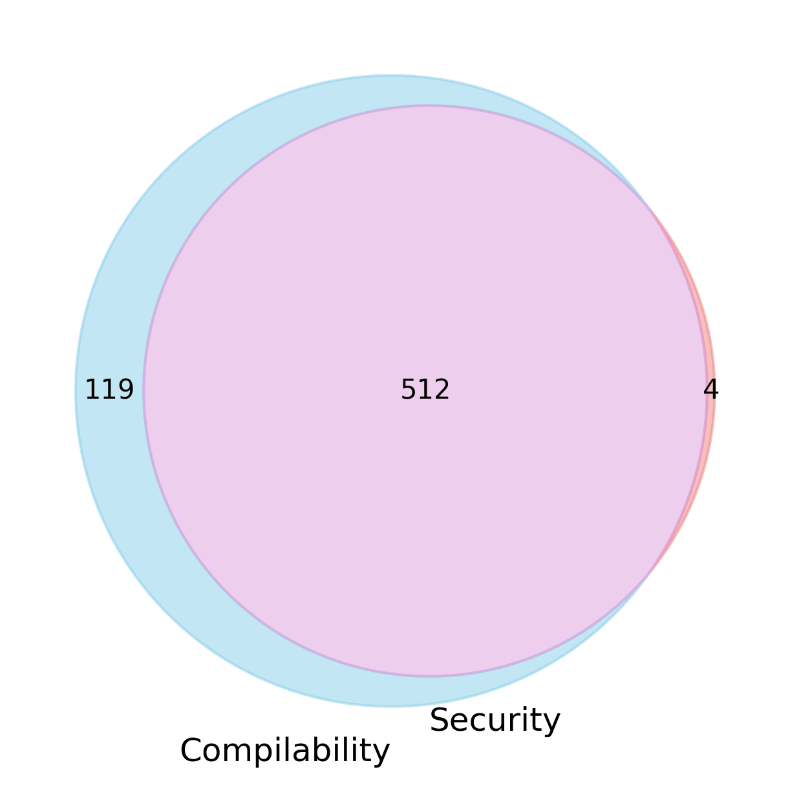
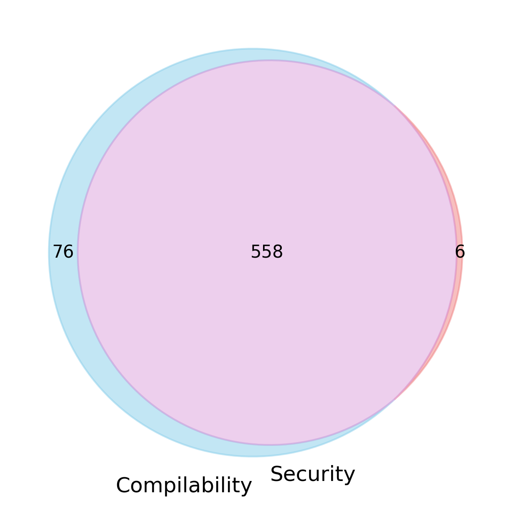
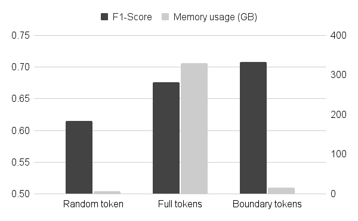
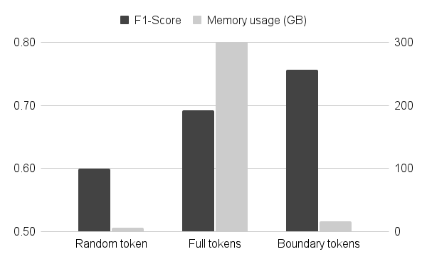
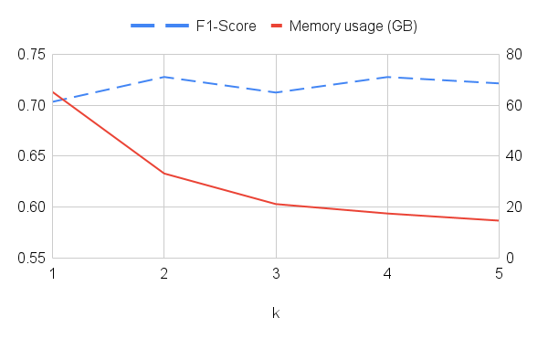
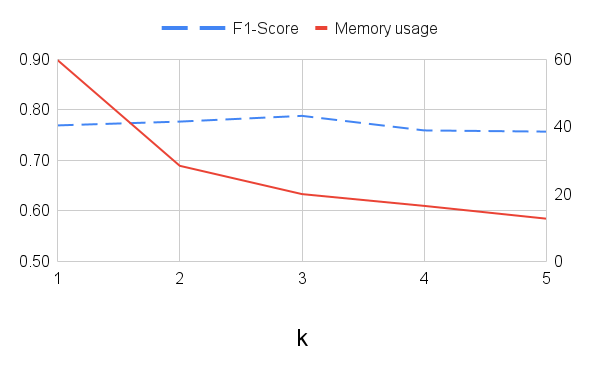

# Model-Agnostic Quality Assessment for LLM-Generated Code via Dynamic Internal Representation Selection

## 1. Abstract
Large Language Models (LLMs) have demonstrated impressive capabilities in code generation and are increasingly integrated into the software development process. However, ensuring the quality of LLM-generated code remains a critical concern. Prior work has shown that the internal representations of LLMs encode meaningful signals for assessing code correctness. Nevertheless, the existing methods rely on representations from pre-selected/fixed layers and token positions, which could limit its generalizability across diverse model architectures and tasks. In this work, we introduce AUTOPROBE, a novel model-agnostic approach that dynamically selects the most informative internal representations for code quality assessment. AUTOPROBE employs an attention-based mechanism to learn importance scores for hidden states, enabling it to focus on the most relevant features. These weighted representations are then aggregated and passed to a probing classifier to predict code quality across multiple dimensions, including compilability, functionality, and security. To evaluate the performance of AUTOPROBE, we conduct extensive experiments across multiple benchmarks and code LLMs. Our experimental results show that AUTOPROBE consistently outperforms the baselines. For security assessment, AUTOPROBE surpasses the state-of-the-art white-box approach by 19%. For compilability and functionality assessment, AUTOPROBE demonstrates its highest robustness to code complexity, with the performance higher than the other approaches by up to 19% and 111%, respectively. These findings highlight that dynamically selecting important internal signals enables AUTOPROBE to serve as a robust and generalizable solution for assessing the quality of code generated by various LLMs.

#### Paper: 

## 2. The Architecture

## 3. Experimental Results

### 3.1 Performance Analysis

#### 3.1.1 Security Assessment

<strong>Click to expand Security Assessment results</strong>

 
**Table 1. Code quality assessment performance in security**

| Code LLM | Method | Accuracy | Precision | Recall | F1-Score |
|---|---|---:|---:|---:|---:|
| **DeepSeek-1.3B** | Oracle | 0.88 | 0.88 | 0.88 | 0.88 |
|  | In-house LLM-AJ | 0.38 | 0.15 | 0.38 | 0.21 |
|  | External LLM-AJ | 0.63 | 0.63 | 0.63 | 0.63 |
|  | CodeBERT | 0.81 | 0.81 | 0.81 | 0.81 |
|  | CodeT5+ | 0.80 | 0.80 | 0.80 | 0.79 |
|  | Openia | 0.81 | 0.81 | 0.81 | 0.81 |
|  | AUTOPROBE | **0.90** | **0.90** | **0.90** | **0.89** |
| **DeepSeek-6.7B** | Oracle | 0.84 | 0.84 | 0.84 | 0.84 |
|  | In-house LLM-AJ | 0.48 | 0.23 | 0.48 | 0.32 |
|  | External LLM-AJ | 0.69 | 0.70 | 0.69 | 0.69 |
|  | CodeBERT | 0.80 | 0.80 | 0.80 | 0.80 |
|  | CodeT5+ | 0.80 | 0.81 | 0.80 | 0.79 |
|  | Openia | 0.81 | 0.81 | 0.81 | 0.81 |
|  | AUTOPROBE | **0.82** | **0.82** | **0.82** | **0.82** |
| **CodeLlama-7B** | Oracle | 0.94 | 0.95 | 0.94 | 0.94 |
|  | In-house LLM-AJ | 0.73 | 0.53 | 0.73 | 0.62 |
|  | External LLM-AJ | 0.50 | 0.70 | 0.50 | 0.51 |
|  | CodeBERT | 0.85 | 0.89 | 0.85 | 0.86 |
|  | CodeT5+ | 0.86 | 0.88 | 0.86 | 0.86 |
|  | Openia | 0.87 | 0.87 | 0.87 | 0.87 |
|  | AUTOPROBE | **0.91** | **0.92** | **0.91** | **0.91** |
| **CodeLlama-13B** | Oracle | 0.89 | 0.89 | 0.89 | 0.89 |
|  | In-house LLM-AJ | 0.64 | 0.40 | 0.64 | 0.49 |
|  | External LLM-AJ | 0.54 | 0.65 | 0.54 | 0.53 |
|  | CodeBERT | 0.82 | 0.84 | 0.82 | 0.83 |
|  | CodeT5+ | 0.83 | 0.84 | 0.83 | 0.83 |
|  | Openia | 0.75 | 0.75 | 0.75 | 0.75 |
|  | AUTOPROBE | **0.88** | **0.88** | **0.88** | **0.88** |
| **MagicCoder-7B** | Oracle | 0.87 | 0.87 | 0.87 | 0.87 |
|  | In-house LLM-AJ | 0.51 | 0.26 | 0.51 | 0.35 |
|  | External LLM-AJ | 0.65 | 0.66 | 0.65 | 0.64 |
|  | CodeBERT | 0.75 | 0.76 | 0.75 | 0.75 |
|  | CodeT5+ | 0.79 | 0.79 | 0.79 | 0.79 |
|  | Openia | 0.73 | 0.73 | 0.73 | 0.73 |
|  | AUTOPROBE | **0.85** | **0.85** | **0.85** | **0.85** |
| **CodeGemma-7B** | Oracle | 0.89 | 0.89 | 0.89 | 0.89 |
|  | In-house LLM-AJ | 0.51 | 0.26 | 0.51 | 0.35 |
|  | External LLM-AJ | 0.63 | 0.65 | 0.63 | 0.62 |
|  | CodeBERT | 0.78 | 0.78 | 0.78 | 0.78 |
|  | CodeT5+ | 0.77 | 0.78 | 0.77 | 0.77 |
|  | Openia | 0.77 | 0.79 | 0.77 | 0.77 |
|  | AUTOPROBE | **0.88** | **0.88** | **0.88** | **0.88** |
| **OSS-20B** | Oracle | 0.89 | 0.89 | 0.89 | 0.89 |
|  | In-house LLM-AJ | 0.32 | 0.10 | 0.32 | 0.15 |
|  | External LLM-AJ | 0.37 | 0.45 | 0.37 | 0.38 |
|  | CodeBERT | 0.76 | 0.77 | 0.76 | 0.76 |
|  | CodeT5+ | 0.84 | 0.84 | 0.84 | 0.84 |
|  | Openia | 0.75 | 0.74 | 0.75 | 0.75 |
|  | AUTOPROBE | **0.89** | **0.89** | **0.89** | **0.89** |

#### 3.1.2 Functionality Assessment

<strong>Click to expand Functionaly Assessment results</strong>

  **Table 2. Code quality assessment performance in functionality**

| Code LLM | Method | Indep. Acc | Indep. F1 | Repo Acc | Repo F1 |
|---|---|---:|---:|---:|---:|
| **DeepSeek-1.3B** | Oracle | 0.66 | 0.66 | 0.88 | 0.85 |
|  | In-house LLM-AJ | 0.55 | 0.50 | 0.24 | 0.27 |
|  | External LLM-AJ | **0.93** | **0.93** | **0.87** | **0.87** |
|  | CodeBERT | 0.50 | 0.45 | 0.86 | 0.81 |
|  | CodeT5+ | 0.47 | 0.34 | 0.86 | 0.83 |
|  | Openia | 0.66 | 0.66 | 0.86 | 0.83 |
|  | AUTOPROBE| 0.63 | 0.63 | **0.87** | 0.84 |
| **DeepSeek-6.7B** | Oracle | 0.77 | 0.72 | 0.77 | 0.75 |
|  | In-house LLM-AJ | 0.32 | 0.26 | 0.48 | 0.50 |
|  | External LLM-AJ | **0.94** | **0.94** | 0.70 | 0.71 |
|  | CodeBERT | 0.35 | 0.35 | 0.71 | 0.68 |
|  | CodeT5+ | 0.66 | 0.66 | 0.73 | 0.69 |
|  | Openia | 0.65 | 0.67 | 0.75 | **0.73** |
|  |AUTOPROBE | 0.71 | 0.71 | **0.76** | **0.73** |
| **CodeLlama-7B** | Oracle | 0.69 | 0.69 | 0.81 | 0.79 |
|  | In-house LLM-AJ | 0.61 | 0.46 | 0.51 | 0.54 |
|  | External LLM-AJ | **0.97** | **0.97** | 0.73 | 0.74 |
|  | CodeBERT | 0.58 | 0.54 | 0.74 | 0.69 |
|  | CodeT5+ | 0.63 | 0.62 | 0.76 | 0.71 |
|  | Openia | 0.69 | 0.68 | **0.81** | **0.79** |
|  | AUTOPROBE | 0.68 | 0.68 | **0.81** | 0.78 |
| **CodeLlama-13B** | Oracle | 0.74 | 0.73 | 0.82 | 0.79 |
|  | In-house LLM-AJ | 0.41 | 0.23 | 0.19 | 0.06 |
|  | External LLM-AJ | **0.95** | **0.95** | 0.77 | 0.78 |
|  | CodeBERT | 0.61 | 0.61 | 0.80 | 0.74 |
|  | CodeT5+ | 0.62 | 0.62 | 0.78 | 0.73 |
|  | Openia | 0.64 | 0.64 | **0.81** | 0.78 |
|  | AUTOPROBE | 0.68 | 0.66 | **0.81** | **0.79** |
| **MagicCoder-7B** | Oracle | 0.74 | 0.69 | 0.78 | 0.74 |
|  | In-house LLM-AJ | 0.27 | 0.11 | 0.74 | 0.65 |
|  | External LLM-AJ | **0.94** | **0.94** | 0.70 | 0.72 |
|  | CodeBERT | 0.46 | 0.49 | 0.73 | 0.69 |
|  | CodeT5+ | 0.54 | 0.56 | 0.72 | 0.69 |
|  | Openia | 0.56 | 0.58 | 0.77 | 0.73 |
|  |AUTOPROBE | 0.69 | 0.66 | **0.81** | **0.78** |
| **CodeGemma-7B** | Oracle | 0.70 | 0.70 | 0.84 | 0.76 |
|  | In-house LLM-AJ | 0.39 | 0.22 | 0.16 | 0.05 |
|  | External LLM-AJ | **0.91** | **0.91** | 0.79 | **0.80** |
|  | CodeBERT | 0.56 | 0.53 | 0.82 | 0.79 |
|  | CodeT5+ | 0.59 | 0.57 | 0.79 | 0.77 |
|  | Openia | 0.61 | 0.59 | 0.82 | 0.77 |
|  | AUTOPROBE| 0.65 | 0.64 | **0.84** | 0.77 |
| **OSS-20B** | Oracle | 0.97 | 0.96 | 0.77 | 0.76 |
|  | In-house LLM-AJ| 0.87 | 0.81 | 0.41 | 0.36 |
|  | External LLM-AJ | **0.97** | **0.97** | 0.65 | 0.66 |
|  | CodeBERT | 0.88 | 0.89 | 0.70 | 0.67 |
|  | CodeT5+ | 0.92 | 0.92 | 0.70 | 0.67 |
|  | Openia | 0.96 | 0.96 | **0.74** | 0.72 |
|  |AUTOPROBE| 0.96 | 0.95 | **0.74** | **0.74** |

#### 3.1.3 Compilability Assessment

<strong>Click to expand Compilability Assessment results</strong>

  **Table 3. Code quality assessment performance in Compilability**

| Code LLM | Method | Indep. Acc | Indep. F1 | Repo Acc | Repo F1 |
|---|---|---:|---:|---:|---:|
| **DeepSeek-1.3B** | Oracle | 0.90 | 0.86 | 0.67 | 0.67 |
|  | In-house LLM-AJ | 0.53 | 0.37 | 0.48 | 0.32 |
|  | External LLM-AJ | **0.91** | **0.89** | 0.55 | 0.50 |
|  | CodeBERT | 0.84 | 0.83 | 0.61 | 0.60 |
|  | CodeT5+ | 0.88 | 0.84 | 0.61 | 0.59 |
|  | Openia | 0.88 | 0.85 | 0.60 | 0.59 |
|  | AUTOPROBE| 0.89 | 0.85 | **0.65** | **0.65** |
| **DeepSeek-6.7B** | Oracle | 0.96 | 0.94 | 0.68 | 0.68 |
|  | In-house LLM-AJ | 0.76 | 0.65 | 0.61 | 0.46 |
|  | External LLM-AJ | 0.94 | 0.94 | 0.61 | 0.55 |
|  | CodeBERT | 0.94 | 0.93 | 0.57 | 0.58 |
|  | CodeT5+ | **0.96** | 0.94 | 0.58 | 0.59 |
|  | Openia | **0.96** | 0.94 | 0.61 | 0.61 |
|  | AUTOPROBE| **0.96** | **0.95** | **0.64** | **0.64** |
| **CodeLlama-7B** | Oracle | 0.90 | 0.86 | 0.66 | 0.66 |
|  | In-house LLM-AJ | 0.39 | 0.22 | 0.58 | 0.42 |
|  | External LLM-AJ | **0.91** | **0.88** | 0.60 | 0.55 |
|  | CodeBERT | 0.87 | 0.84 | 0.55 | 0.55 |
|  | CodeT5+ | 0.56 | 0.65 | 0.60 | 0.59 |
|  | Openia | 0.88 | 0.86 | 0.60 | 0.61 |
|  |AUTOPROBE | 0.90 | 0.86 | **0.66** | **0.66** |
| **CodeLlama-13B** | Oracle | 0.90 | 0.88 | 0.70 | 0.71 |
|  | In-house LLM-AJ | 0.41 | 0.23 | 0.57 | 0.42 |
|  | External LLM-AJ | **0.91** | **0.91** | 0.60 | 0.54 |
|  | CodeBERT | 0.81 | 0.79 | 0.60 | 0.59 |
|  | CodeT5+ | 0.90 | 0.88 | 0.62 | 0.62 |
|  | Openia | 0.87 | 0.87 | 0.66 | 0.66 |
|  | AUTOPROBE | 0.90 | 0.87 | **0.69** | **0.69** |
| **MagicCoder-7B** | Oracle | 0.96 | 0.94 | 0.68 | 0.69 |
|  |In-house LLM-AJ | 0.73 | 0.62 | 0.60 | 0.45 |
|  | External LLM-AJ | 0.95 | **0.95** | **0.66** | 0.63 |
|  | CodeBERT | 0.94 | 0.93 | 0.58 | 0.58 |
|  | CodeT5+ | 0.88 | 0.90 | 0.57 | 0.57 |
|  | Openia | **0.96** | 0.94 | 0.61 | 0.61 |
|  | AUTOPROBE | **0.96** | 0.94 | **0.66** | **0.67** |
| **CodeGemma-7B** | Oracle | 0.88 | 0.86 | 0.68 | 0.68 |
|  |In-house LLM-AJ | 0.44 | 0.27 | 0.52 | 0.36 |
|  | External LLM-AJ | 0.88 | 0.86 | 0.55 | 0.49 |
|  | CodeBERT | 0.81 | 0.82 | 0.58 | 0.56 |
|  | CodeT5+ | 0.78 | 0.80 | 0.61 | 0.60 |
|  | Openia | 0.84 | 0.79 | 0.67 | 0.67 |
|  |AUTOPROBE| **0.90** | **0.89** | **0.69** | **0.69** |
| **OSS-20B** | Oracle | 0.99 | 0.99 | 0.76 | 0.75 |
|  |In-house LLM-AJ | 0.89 | 0.84 | 0.62 | 0.57 |
|  | External LLM-AJ | 0.89 | 0.87 | 0.67 | 0.65 |
|  | CodeBERT | 0.91 | 0.92 | 0.65 | 0.65 |
|  | CodeT5+ | 0.96 | 0.96 | 0.64 | 0.64 |
|  | Openia | 0.98 | 0.98 | 0.69 | 0.69 |
|  | AUTOPROBE | **0.99** | **0.99** | **0.71** | **0.70** |

#### 3.1.4 Correlation of Accurate Predictions Across Code Quality Criteria

<strong>Correlation of accurate predictions for compilability and functionality</strong>

 

**Figure 1. DeepSeek**

**Figure 2. CodeGemma**

<strong>Correlation of accurate prediction for compilability and security</strong>

 

**Figure 3. DeepSeek**

**Figure 4. CodeGemma**

### 3.2 Instrinsic Analysis
#### 3.2.1 Impact of Representation Sampling Strategies
##### Impact of token sampling on AUTOPROBE's performance and memory usage, left axis: F1-Score; right axis: Memory usage (GB)

<strong>Click to expand result of token sampling impact </strong>

  

**Figure 5. DeepSeek**

**Figure 6. CodeGemma**

##### Impact of layer sampling on AUTOPROBE's performance and memory usage, left axis: F1-Score; right axis: Memory usage (GB)

<strong>Click to expand result of layer sampling impact </strong>

  

**Figure 7. DeepSeek**

**Figure 8. CodeGemma**

#### 3.2.2 Impact of Informative Representation Selector

<strong>Click to expand result of representation selector impact </strong>

**Table 4: Impact of Informative Representation Selector on AUTOPROBE Performance**

  
| Model      | Setting           | Accuracy | Precision | Recall | F1-Score |
|------------|-------------------|----------|-----------|--------|----------|
| CodeGemma  | Without selector  | 0.70     | 0.70      | 0.70   | 0.69     |
|            | With selector     | 0.76     | 0.76      | 0.76   | 0.76     |
| DeepSeek   | Without selector  | 0.69     | 0.67      | 0.69   | 0.69     |
|            | With selector     | 0.72     | 0.71      | 0.72   | 0.71     |

#### 3.2.3 Impact of Aggregation and Probing Classier

<strong>Click to expand result of aggregation function impact </strong>

**Table 5: Impacts of Aggregation Functions on AUTOPROBE's Performance**

  
| Model     | Method  | Accuracy | Precision | Recall | F1-Score |
|-----------|---------|----------|-----------|--------|----------|
| CodeGemma | Concat  | 0.76     | 0.76      | 0.76   | 0.76     |
|           | Average | 0.76     | 0.76      | 0.76   | 0.76     |
|           | Sum     | 0.76     | 0.76      | 0.76   | 0.76     |
|           | Max     | 0.79     | 0.80      | 0.79   | 0.79     |
|           | Min     | 0.73     | 0.73      | 0.73   | 0.73     |
| DeepSeek  | Concat  | 0.70     | 0.70      | 0.70   | 0.70     |
|           | Average | 0.72     | 0.71      | 0.72   | 0.70     |
|           | Sum     | 0.72     | 0.71      | 0.72   | 0.71     |
|           | Max     | 0.71     | 0.72      | 0.71   | 0.72     |
|           | Min     | 0.70     | 0.70      | 0.70   | 0.70     |

<strong>Click to expand result of classifier impact </strong>

**Table 5: Impacts of Classifier on AUTOPROBE's Performance**

| Model     | Classifier           | Accuracy | Precision | Recall | F1-Score |
|-----------|----------------------|----------|-----------|--------|----------|
| CodeGemma | MLP                  | 0.76     | 0.76      | 0.76   | 0.76     |
|           | Logistic regression  | 0.77     | 0.77      | 0.77   | 0.77     |
|           | SVM                  | 0.47     | 0.22      | 0.47   | 0.30     |
| DeepSeek  | MLP                  | 0.72     | 0.71      | 0.72   | 0.71     |
|           | Logistic regression  | 0.72     | 0.72      | 0.72   | 0.72     |
|           | SVM                  | 0.66     | 0.43      | 0.66   | 0.52     |

